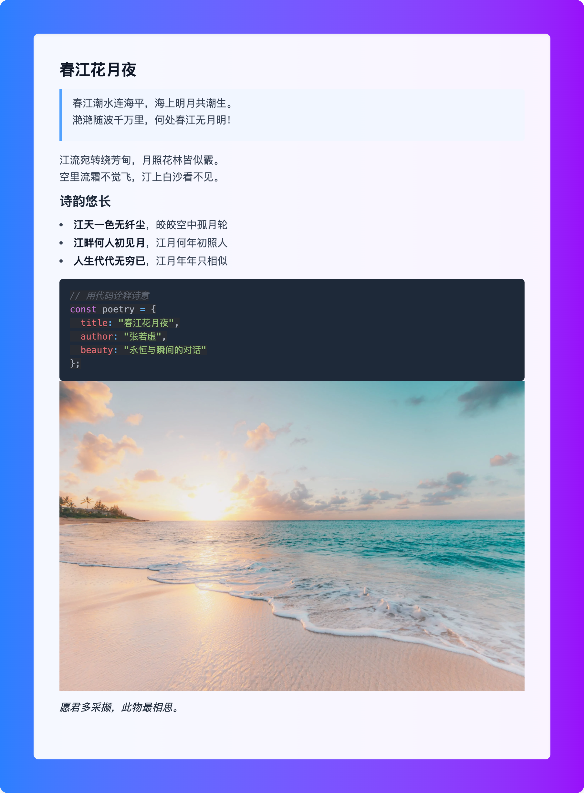
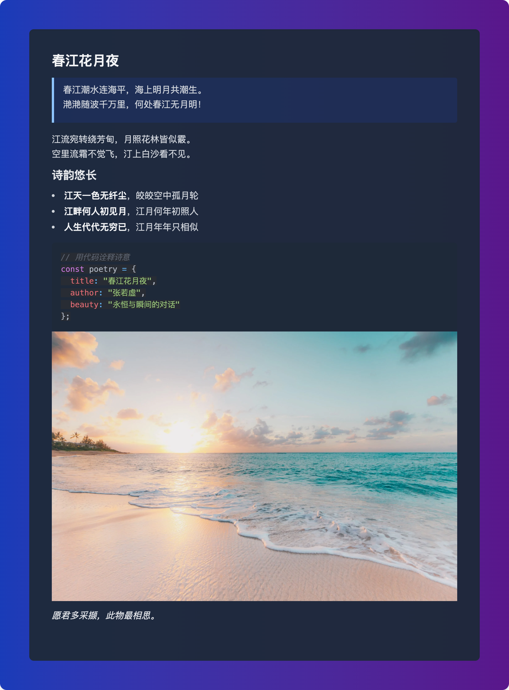
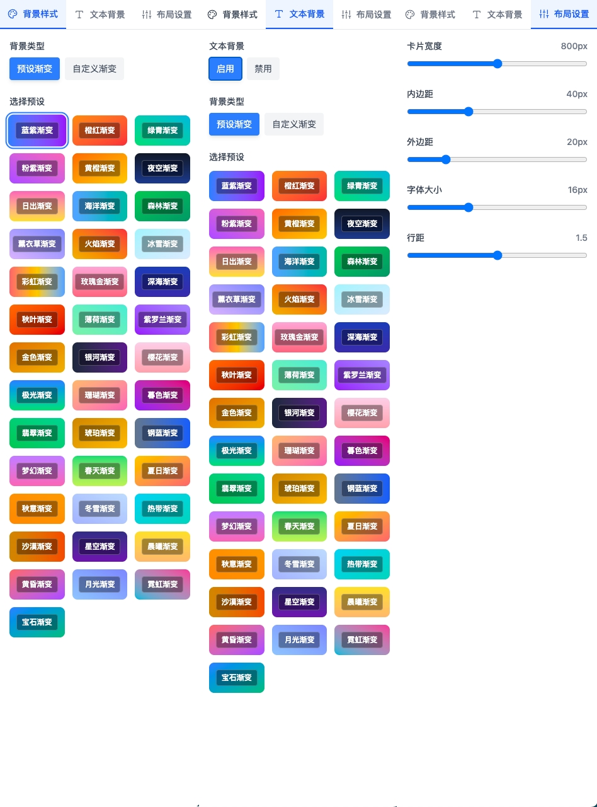

# MarkPic

将 Markdown 文本转换为精美图片的在线工具。左边写 Markdown，右边实时生成图片。

## 📸 预览







## 功能特性

- 40+ 预设渐变背景，支持自定义渐变
- 暗黑模式，跟随系统主题
- Monaco Editor 编辑器，支持语法高亮
- 实时预览，所见即所得
- 响应式设计，支持移动端
- 图片下载和剪贴板复制
- 可调整布局参数（宽度、边距、字体等）
- 拖拽调整编辑器和预览区域比例
- Toast 通知提示

## 开发

环境要求：Node.js >= 18，pnpm >= 9

```bash
# 安装依赖
pnpm install

# 启动开发服务器
pnpm dev

# 构建
pnpm build
```

## 🛠️ 技术栈

- **前端框架**: React 19 + TypeScript
- **构建工具**: Vite
- **样式框架**: TailwindCSS v4
- **编辑器**: Monaco Editor
- **Markdown 渲染**: react-markdown + remark-gfm
- **代码高亮**: react-syntax-highlighter
- **图片生成**: html-to-image
- **包管理器**: pnpm

## 使用方法

1. 左侧编辑器输入 Markdown 文本
2. 右侧实时预览渲染效果
3. 调整样式参数（背景、布局、字体等）
4. 导出图片或复制到剪贴板

### 样式设置

- 背景：40+ 预设渐变 + 自定义渐变
- 布局：卡片宽度 400-1200px，内外边距可调
- 字体：大小 12-24px，行距 1.0-2.0
- 界面：拖拽调整编辑器/预览区域比例

## 🔧 开发

### 项目结构

```
src/
├── components/          # React 组件
│   ├── ControlPanel.tsx # 控制面板
│   ├── ImagePreview.tsx # 图片预览
│   ├── MarkdownEditor.tsx # Markdown 编辑器
│   └── Toast.tsx        # 通知组件
├── App.tsx             # 主应用组件
├── index.css           # 全局样式
└── main.tsx           # 应用入口
```

### 核心组件

- **App.tsx**: 主应用逻辑，状态管理和布局控制
- **MarkdownEditor.tsx**: Monaco Editor 集成，支持折叠功能
- **ImagePreview.tsx**: Markdown 渲染和图片导出
- **ControlPanel.tsx**: 样式控制面板，背景和布局设置
- **Toast.tsx**: 通知系统，替代原生 alert

### 开发规范

- 使用 TypeScript 严格模式
- 遵循 React 19 最佳实践
- 使用 TailwindCSS 进行样式开发
- 组件化开发，保持单一职责
- 完善的错误处理和用户体验

## 许可证

MIT License

## 🤝 贡献

欢迎提交 Issue 和 Pull Request！

## 📞 联系

如有问题或建议，请通过 GitHub Issues 联系。
